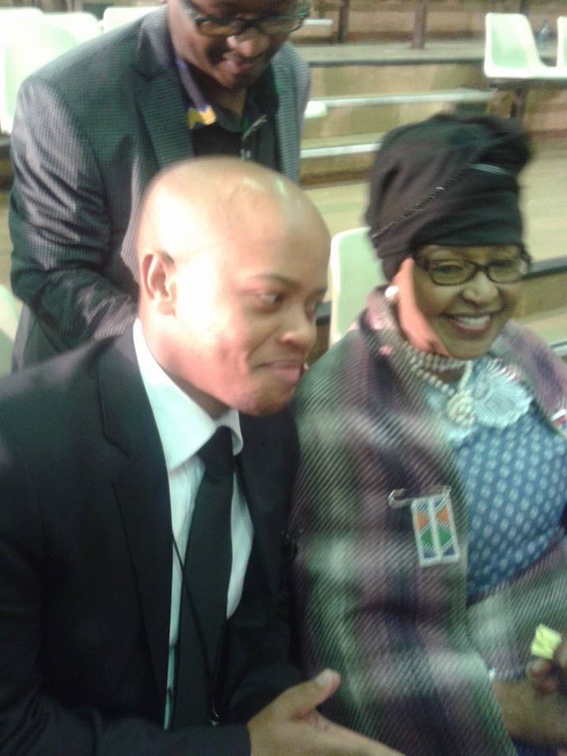

# Tshepo Creates a RAEDME
 
 **I am slowly but surely getting the hang of programming, python is still a real issue though, in the web space. I am afforded a year to get myself to an acceptable level of programming, the following is a list of things I want to have done by the end of the year**

* Understand and use python code
* Create a web page using html
	* Personal Page
	* Blog
* Be able to collaborate on the git platform
* etc

## Contact Table
 
 Name | Email | Number
--- | --- | ---
Tshepo Morabane | tshepo.meltwater.org | +233 20 141 5019

[My website hosted on Surge](http://kaput-scene.surge.sh)

See you soon
:wink: